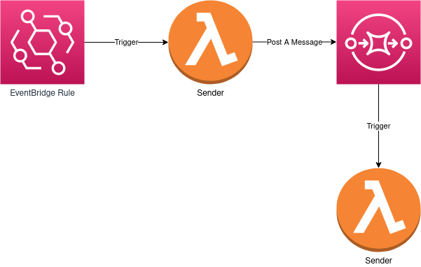

# Demo App

In this demo, we have some feature:

- An EventBridge Rule
- Two Lambda functions
- A AWS SQS Standard Queue

## Architecture



## Usage

To deploy this application:

```
sls deploy
```

_You can set the `stage` and `region` with the respective flags `--stage` and `--region`._

To remove the application:

```
sls remove
```

_If you used flags to deploy the application, you must use them again_

## References


